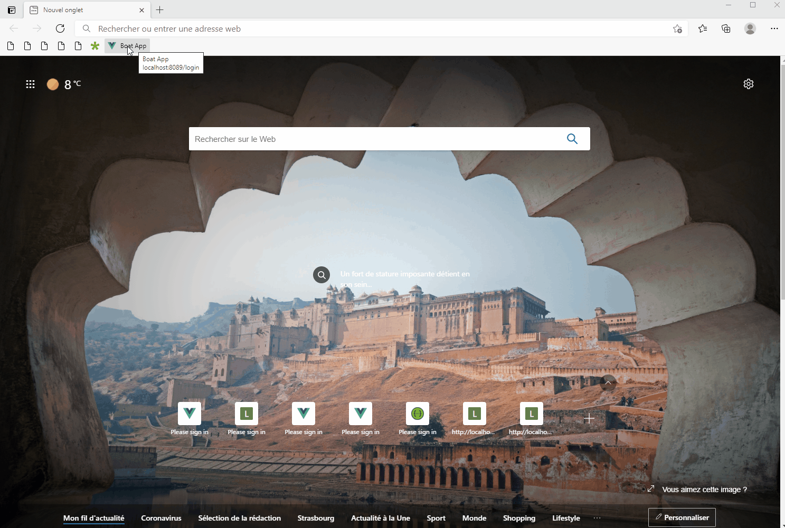
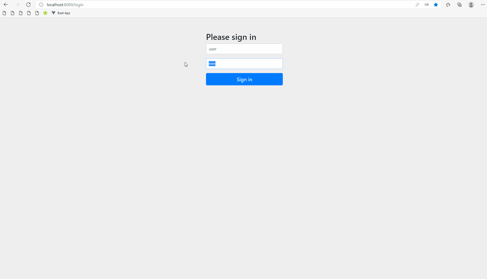
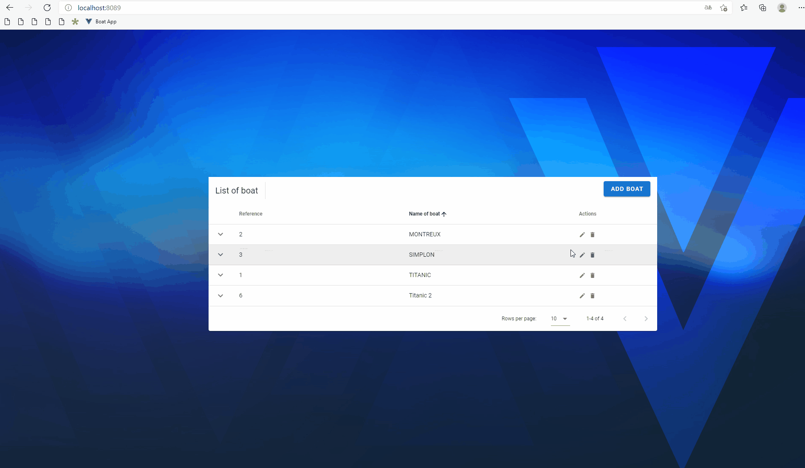
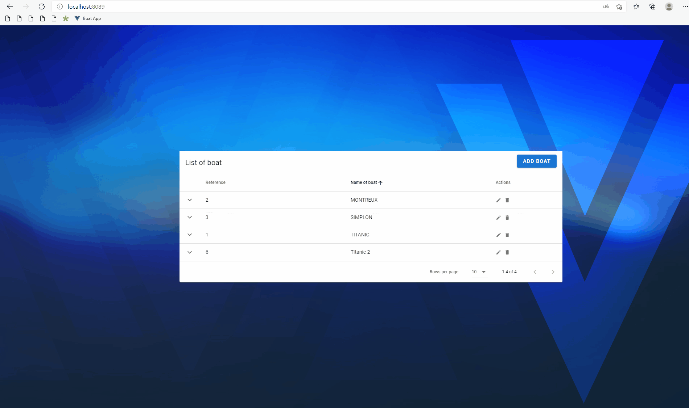
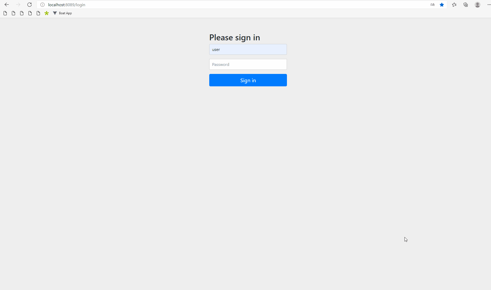

# boat-app-gui

## Context
Boat-App-Gui, It’s a simple app, where a user can get a quick overview over list of boats

#### The following user cases are implemented : 

##### UC1

The user opens your app and gets a login screen. He has to login. After a successful login he is navigated to
the overview page (UC2).

##### UC2

The user has a list of all boat resources

##### UC3

The user can add or update or delete boat
###### Add new boat

###### Update boat

###### Delete boat

##### UC4

The user clicks on a boat item and gets a detail view over it.

##### UC5

Authentication / Authorization (only authenticated user can access to the resources )

## Install boat-app-gui 
Please follow the following steps


## Project setup
```
yarn install
```

## Project setup
```
yarn install
```

#### Compiles and hot-reloads for development
```
yarn serve
```

### Compiles and minifies for production
```
yarn build
```

### Lints and fixes files
```
yarn lint
```
### Run test
```
yarn test
```
### Run test with coverage
```
yarn test:coverage
```

### Customize configuration
See [Configuration Reference](https://cli.vuejs.org/config/).
